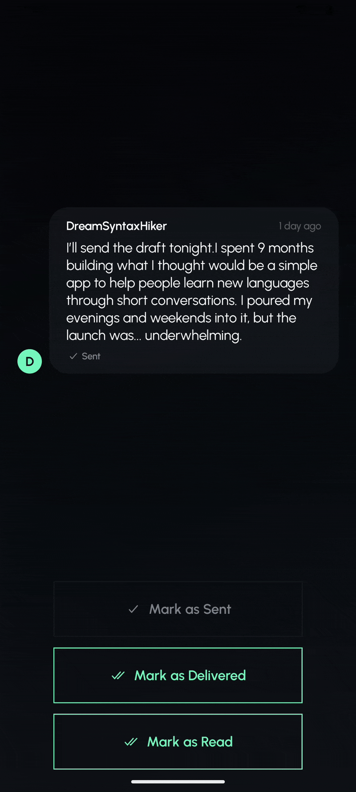

# 👩🏻‍💻📓✍🏻💡 Challenge Set - July 2025 - Conversations

Part of the **Mobile Dev Campus Main App Challenge** by [Philipp Lackner](https://pl-coding.com/campus)

## Mini challenge 1 : [Easy] - Emoji Reaction Bubble
### 🎭 Scenario
Your friend group chat is pure chaos — every message sparks debate, and everyone’s tired of typing “lol” or “💀” every time. Build a simple emoji reaction bubble so users can tap a message, pick an emoji, and see who reacted with what (one per person, no duplicates).
### 🎯 Feature Goal
Create a tappable emoji reaction system for a chat interface. When the user taps an emoji, the reaction appears in a compact bubble inside the message, grouped with other users’ reactions.
### 🎥 Demo

---

## Mini challenge 2 : [Easy] - Bottom Navigation Unread Badge
### 🎭 Scenario
Your app has three tabs: Calls, Chats, and Settings. Users keep ignoring Calls and missing new Chats. Add unread badges to the bottom navigation so users know where to tap. Settings doesn’t need a badge (nobody rushes there anyway).
### 🎯 Feature Goal
Show and manage unread notification badges on the bottom navigation bar in multiple ways.
### 🎥 Demo

---

## Mini challenge 3 : [Easy] - Message Card
### 🎭 Scenario
You’re building the message screen for a chat app and your designer drops a Figma link with zero context… again. Now it’s on you to nail the look of a clean, modern message bubble.
### 🎯 Feature Goal
Create a message bubble that displays the sender’s name, a circular icon with their initials, a relative timestamp (e.g. “5 min ago”), and a read or delivered status indicator. Focus on polished layout and visual hierarchy — this is a static UI challenge with no interactivity.
### 🎥 Demo

---

## 🧠 What I put in practice

- Layouts with Jetpack Compose **constraint layout in compose**, **flow rows**, **animations**.
- Custom **bottom navigation** for reusable UI components.
---

## 📜 License

This project is open-source and free to use. Attribution appreciated! 🙌

---

## 🤝 Acknowledgements

Special thanks to [Philipp Lackner](https://pl-coding.com/campus) and the **Mobile Dev Campus** community for inspiring this mini challenges and helping sharpen real-world development skills.

---